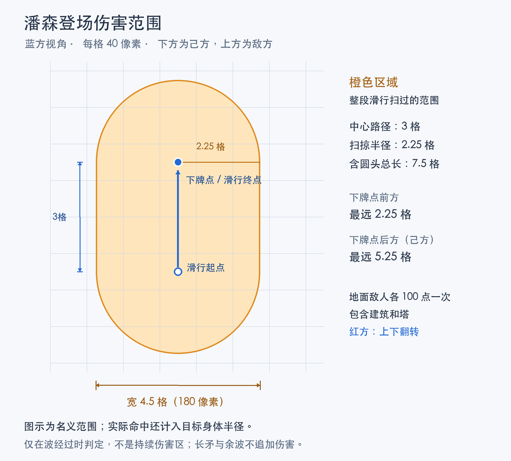

# 潘森

[← 返回总索引](README.md)

4费近战进攻核心，可在敌方半场的合法地面部署，滑行冲击波伤害沿途敌人；红怒强化短枪刺击。

| 项目 | 数值 |
| --- | --- |
| 费用 / 生命 | <!-- card-fact: pantheon cost -->4 / <!-- card-fact: pantheon hp -->640 |
| 普攻 / 间隔 / 首击 | <!-- card-fact: pantheon damage -->72 / <!-- card-fact: pantheon interval -->0.9秒 / 0.28秒 |
| 攻击距离 / 目标 | 40 / 地面单位及建筑 |
| 移速 / 身体半径 | 68 / 18 |
| 部署 | 通用0.5秒命令缓冲 + <!-- card-fact: pantheon pre_deploy_time -->1.3秒彗星登场预部署 + <!-- card-fact: pantheon deploy_time -->1.0秒落地与收势 |
| 登场伤害 | 彗星从落点己方侧3格（120像素）处着地，冲击波沿滑行路径以半径90扫掠；每名地面敌人波及时受100点伤害一次，无击退 |

## 部署时序与登场伤害

2026-09-27用户确认当前登场特效定稿。本轮不再调整特效；以下为当前权威配置。

| 阶段 | 持续 | 从普通下牌指令起算 |
| --- | --- | --- |
| 通用命令缓冲 | 0.50秒 | 0–0.50秒 |
| 长矛标记落点 | 0.20秒 | 0.50–0.70秒 |
| 空中俯冲，第一剪影fly | 0.45秒 | 0.70–1.15秒 |
| 地面滑行，第二剪影slide；沿途伤害 | 0.65秒 | 1.15–1.80秒 |
| 正式潘森出现，拿矛Spell4_Hit | 0.30秒 | 1.80–2.10秒 |
| 收势Spell4_Hit_ToIdle | 0.70秒 | 2.10–2.80秒 |

总计2.80秒；审查网站的立即出牌跳过0.50秒命令缓冲，因此录像中的动作时间为2.30秒。正常下牌后1.80秒才存在潘森实体，此后可受伤/被推挤，但到2.80秒部署锁定结束才可行动。实际模拟为20Hz。

余波与拿矛/收势重叠，普通下牌后1.85–2.75秒播放（录像动作时间1.35–2.25秒）；由冲击罩消亡触发，仅有表现，不追加伤害。长矛落下也没有伤害。

登场伤害的中心从**下牌点朝己方后退3格（120像素）**的位置，沿直线滑到下牌点。运动先快后慢，每Tick检查上一中心到当前中心的线段，半径90像素（2.25格）。整个阶段扫过的区域是**中轴120像素、半径90像素的胶囊形**：宽180像素（4.5格），含圆头总长300像素（7.5格）。以静止目标为例，中心线前端最多覆盖下牌点前方90像素，后端覆盖己方侧210像素，两端为圆弧而非矩形。

蓝方由下向上滑：起点为下牌点y+120；红方由上向下滑：起点为y−120。判定还加上目标body_radius，即目标身体碰到扫掠区便可命中。地面敌方单位、建筑和塔每个最多承受100点基础伤害一次，不击退；友军和空中单位不受伤，仍遵守共通保护/伤害规则。它不是持续铺在整条路上的伤害区：只在波经过当前分段时判定，拿矛、终点和余波均不另补一次伤害。可见火焰/罩体边缘不代表精确的权威边界。

贯星长枪：<!-- card-fact: pantheon active_skills.0.cost -->1金币，冷却<!-- card-fact: pantheon active_skills.0.cooldown -->4秒，每次部署最多用<!-- card-fact: pantheon active_skills.0.max_uses -->3次。向前120、宽40的直线区域刺击，0.30秒结算120点伤害，施法总长0.4秒；锁移动、普攻、朝向。友军、身后及空中目标不受伤，建筑可受伤。

仅实际携带本技能时，普攻出手增加1层红怒，上限4。释放前未满四层时保留原层数并加1层；三层释放仍是普通Q，并到达四层。释放前满四层时清空全部，伤害240。层数在施法开始时固定，排队不提前消费；空放仍消耗次数并按相同规则增怒或耗怒。死亡、主动资格替换后清除，实例之间不共享；不随时间衰减。未满层为白条，满四层改为暗深红条，并在长枪、盾牌和身体显示原版纹理适配的红怒特效；耗怒、失去主动资格和死亡后关闭。施法按共通控制规则：冰冻取消依附后段，已经开始的技能不因眩晕撤销。

初版生命和伤害由同费近战卡估值，尚未经长期平衡测试。部署落点沿用卡牌大师全图地面规则，仍禁止非法河道及结构占位。落地实体可受伤和被推挤，动画不驱动伤害。

[动画](animations/pantheon.md) · [声音](audio/pantheon.md) · [特效](effects/pantheon.md) · [卡牌大师](twisted_fate.md)
